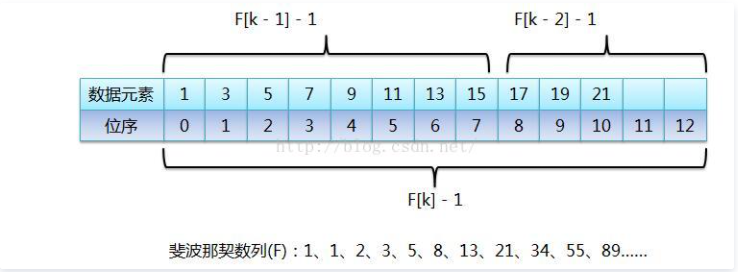
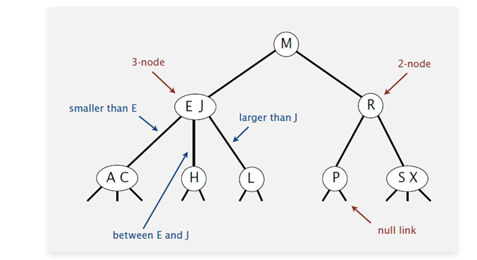
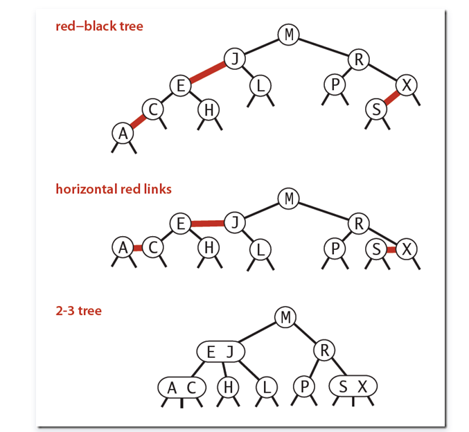
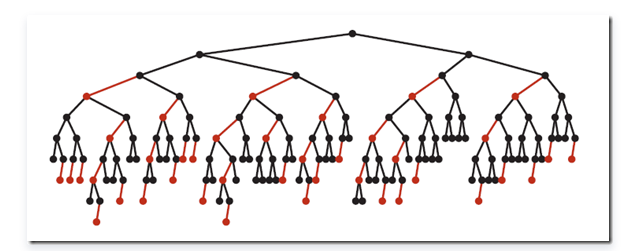

# 查找算法总结及其算法实现（Python/Java）

本文总结了常用的查找算法，内容包括：

-   查找算法的定义和思路，动画演示
-   查找算法的代码实现：Python 和 Java
-   查找算法性能分析：时间空间复杂度分析
-   不同排序算法最佳使用场景

此文属于知识点复习手册专栏内容，你还可以**通过以下两种途径查看全复习手册文章导航**：

-   [全复习手册文章导航 (CSDN)](https://blog.csdn.net/qqxx6661/article/details/86775594)

## 一、查找算法分类

1）静态查找和动态查找；

注：静态或者动态都是针对查找表而言的。动态表指查找表中有删除和插入操作的表。

2）无序查找和有序查找。

-   无序查找：被查找数列有序无序均可；
-   有序查找：被查找数列必须为有序数列。

## 二、平均查找长度（Average Search Length，ASL）

**需和指定 key 进行比较的关键字的个数的期望值**，称为查找算法在查找成功时的平均查找长度。

对于含有 n 个数据元素的查找表，查找成功的平均查找长度为：`ASL = Pi*Ci`的和。

Pi：查找表中第 i 个数据元素的概率。

Ci：找到第 i 个数据元素时已经比较过的次数。

## 三、查找性能

从快到慢：

-   顺序查找，时间复杂度 O(N),
-   分块查找，时间复杂度 O(logN+N/m);
-   二分查找，时间复杂度 O(logN)
-   Fibonacci 查找，时间复杂度 O(logN)
-   差值查找，时间复杂度 O(log(logN))
-   哈希查找，时间复杂度 O(1)

---

### 1. 顺序查找

说明：属于有序查找，顺序查找适合于存储结构为顺序存储或链接存储的线性表。

**复杂度分析：**

查找成功时的平均查找长度为：

（假设每个数据元素的概率相等） `ASL = 1/n(1+2+3+…+n) = (n+1)/2 ;`

当查找不成功时，需要 n+1 次比较，时间复杂度为 **O(n)**;

所以，顺序查找的时间复杂度为 **O(n)**。

Java 实现：

```
public static int SequenceSearch(int a[], int value, int n) {
		for(int i=1;i<n;i++) {
			if(a[i]==value) {
				return i;
			}
		}
		return -1;
	}
```

### 2. 二分查找

二分查找经典理解：[https://www.zhihu.com/question/36132386/answer/155438728](https://www.zhihu.com/question/36132386/answer/155438728)

**基本思想：**

也称为是折半查找，属于有序查找算法。用给定值 k 先与中间结点的关键字比较，中间结点把线形表分成两个子表，若相等则查找成功；若不相等，再根据 k 与该中间结点关键字的比较结果确定下一步查找哪个子表，这样递归进行，直到查找到或查找结束发现表中没有这样的结点。

**复杂度分析：**

最坏情况下，关键词比较次数为 log2(n+1)，且期望时间复杂度为 **O(log2n)**；对于一个有 1024 个元素的数组，在最坏的情况下，二分查找法只需要比较 log2n + 1= 11 次，而在最坏的情况下线性查找要比较 1023 次。

注：折半查找的前提条件是需要有序表顺序存储，对于静态查找表，一次排序后不再变化，折半查找能得到不错的效率。但对于需要频繁执行插入或删除操作的数据集来说，维护有序的排序会带来不小的工作量，那就不建议使用。——《大话数据结构》 注意点：为什么 (low +high) / 2 会溢出啊？答：两个很大的 int 相加的话超出 Integer.MAX_VALUE 了

Java 实现：

```java
public static int BinarySearch(int a[], int value, int n) {
		int low = 0;
		int high = n-1;
		int mid = 0;
		while (low <= high) {
			mid = low + (high - low) * 1/2;
			if(a[mid] == value) {
				return mid;
			}
			if(a[mid] > value) {
				high = mid - 1;
			}
			else {
				low = mid + 1;
			}
		}
		return -1;
	}

public int binarySearchRecur(int[] nums, int target, int low, int high) {
	if (low > high) { return low; }
	int mid = low + (high - low) / 2;
	if (nums[mid] > target) {
		return binarySearchRecur(nums,target,low,mid-1);
	} else if (nums[mid] < target) {
		return binarySearchRecur(nums,target,mid+1,high);
	} else {
		return mid;
	}
}


public static int BinarySearchDuplicate(int a[], int value, int n) {
	int low = 0;
	int high = n-1;
	int mid = 0;
	while (low <= high) {
		mid = low + (high - low) * 1/2;
		if(a[mid] >= value) {
			high = mid - 1;
		}
		else {
			low = mid + 1;
		}
	}
	return low;
}

public int firstOccurrenceRecur(int[] nums, int target, int low, int high) {
	if (low > high) { return low; }
		int mid = low + (high - low) / 2;
	if (nums[mid] < target) {
		return firstOccurrenceRecur(nums,target,mid + 1,high);
	} else {
		return firstOccurrenceRecur(nums,target,low,mid-1);
	}
}
```

### 3. 插值查找

通过类比，我们可以将二分查找的点改进为如下：

```java
mid=low+(high-low)*(key-a[low])/(a[high]-a[low])
```

**也就是将上述的比例参数 1/2 改进为自适应的，根据关键字在整个有序表中所处的位置，让 mid 值的变化更靠近关键字 key，这样也就间接地减少了比较次数。** **基本思想：**

基于二分查找算法，将查找点的选择改进为自适应选择，可以提高查找效率。当然，差值查找也属于有序查找。

注：对于表长较大，而关键字分布又比较均匀的查找表来说，插值查找算法的平均性能比折半查找要好的多。反之，数组中如果分布非常不均匀，那么插值查找未必是很合适的选择。

**复杂度分析：**

查找成功或者失败的时间复杂度均为 **O(log2(log2n))**。

Java 实现：

```java
public static int InsertionSearch(int a[], int value, int n) {
		int low = 0;
		int high = n-1;
		int mid = 0;
		while (low <= high) {
			mid = low + (high-low) * (value-a[low]) / (a[high]-a[low]);
			if(a[mid] == value) {
				return mid;
			}
			if(a[mid] > value) {
				high = mid - 1;
			}
			else {
				low = mid + 1;
			}
		}
		return -1;
	}
```

### 4. 斐波那契查找

[https://blog.csdn.net/zsw12013/article/details/50003505](https://blog.csdn.net/zsw12013/article/details/50003505)



斐波那契查找与折半查找很相似，他是根据斐波那契序列的特点对有序表进行分割的。**他要求开始表中记录的个数为某个斐波那契数小 1**，n=F(k)-1;

**复杂度分析：** 最坏情况下，**时间复杂度为 O(log2n)，且其期望复杂度也为 O(log2n)**。

**注意：生成的数组长度是 f[k]-1 而不是 f[k]**

Java：

```java
public final static int MAXSIZE = 20;
    public static int[] fibonacci() {
        int[] f = new int[MAXSIZE];
        int i = 0;
        f[0] = 1;
        f[1] = 1;
        for (i = 2; i < MAXSIZE; i++) {
            f[i] = f[i - 1] + f[i - 2];
        }
        return f;
    }

    public static int fibonacciSearch(int[] a, int value, int n) {
        int low = 0;
        int high = n - 1;
        int mid = 0;
        int k = 0;
        int i = 0;
        int[] f = fibonacci();

        while (n > f[k] - 1) {
            k++;
        }

        int[] temp = new int[f[k] - 1];
        for (int j = 0; j < n;j++) {
        	temp[j] = a[j];
        }

        for (i = n; i < f[k] - 1; i++) {
            temp[i] = temp[high];
        }

        while (low <= high) {
            mid = low + f[k - 1] - 1;
            if (temp[mid] > value) {
                high = mid - 1;
                k = k - 1;
            } else if (temp[mid] < value) {
                low = mid + 1;
                k = k - 2;
            } else {
                if (mid <= high) {
                    return mid;
                } else {
                    return high;
                }
            }
        }
        return -1;
    }
```

Python：

```python
MAXSIZE = 20

def fibonacci():  # 1, 1, 2, 3, 5, 8, 13, 21, 34, 55, 89
    f = [0] * MAXSIZE
    f[0] = 1
    f[1] = 1
    for i in range(2, MAXSIZE):
        f[i] = f[i-1] + f[i-2]
    return f

def fibonacciSearch(array, value):
    low, mid, high = 0, 0, len(array)-1
    k = 0
    f = fibonacci()
    while len(array) > f[k]-1:
        k += 1
    temp = array + [array[-1] * (f[k]-1-len(array))]
    while low <= high:
        mid = low + f[k-1] - 1
        if temp[mid] > value:
            high = mid - 1
            k = k - 1
        elif temp[mid] < value:
            low = mid + 1
            k = k - 2
        else:
            if mid <= high: # 如果在high位前，则返回mid位置，否则返回high位置
                return mid
            else:
                return high
    return -1

if __name__ == '__main__':
    a = [1, 3, 5, 6, 7, 88]
    print(fibonacciSearch(a, 2))
```

### 5. 树表查找

#### 5.1 最简单的树表查找算法——二叉树查找算法

**基本思想：**

**这个算法的查找效率很高，但是如果使用这种查找方法要首先创建树。**

二叉查找树（BinarySearch Tree，也叫二叉搜索树，或称二叉排序树 Binary Sort Tree）或者是一棵空树，或者是具有下列性质的二叉树：

1）若任意节点的左子树不空，则左子树上所有结点的值均小于它的根结点的值；

2）若任意节点的右子树不空，则右子树上所有结点的值均大于它的根结点的值；

3）任意节点的左、右子树也分别为二叉查找树。

**二叉查找树性质：**

对二叉查找树进行中序遍历，即可得到有序的数列。

有关二叉查找树的查找、插入、删除等操作的详细讲解，请移步[浅谈算法和数据结构: 七 二叉查找树](http://www.cnblogs.com/yangecnu/p/Introduce-Binary-Search-Tree.html)

**复杂度分析：**

它和二分查找一样，插入和查找的时间复杂度均为 O(logn)，但是在最坏的情况下仍然会有 O(n) 的时间复杂度。原因在于插入和删除元素的时候，树没有保持平衡（比如，我们查找上图（b）中的 “93”，我们需要进行 n 次查找操作）。我们追求的是在最坏的情况下仍然有较好的时间复杂度，这就是平衡查找树设计的初衷。

基于二叉查找树进行优化，进而可以得到其他的树表查找算法，如平衡树、红黑树等高效算法。

#### 5.2 平衡查找树之 2-3 查找树（2-3 Tree）

[https://riteme.github.io/blog/2016-3-12/2-3-tree-and-red-black-tree.html](https://riteme.github.io/blog/2016-3-12/2-3-tree-and-red-black-tree.html)

2-3 查找树定义：和二叉树不一样，2-3 树运行每个节点保存 1 个或者两个的值。对于普通的 2 节点 (2-node)，他保存 1 个 key 和左右两个自己点。对应 3 节点 (3-node)，保存两个 Key，2-3 查找树的定义如下：

1）要么为空，要么：

2）对于 2 节点，该节点保存一个 key 及对应 value，以及两个指向左右节点的节点，左节点也是一个 2-3 节点，所有的值都比 key 要小，右节点也是一个 2-3 节点，所有的值比 key 要大。

3）对于 3 节点，该节点保存两个 key 及对应 value，以及三个指向左中右的节点。左节点也是一个 2-3 节点，所有的值均比两个 key 中的最小的 key 还要小；中间节点也是一个 2-3 节点，中间节点的 key 值在两个跟节点 key 值之间；右节点也是一个 2-3 节点，节点的所有 key 值比两个 key 中的最大的 key 还要大。

**2-3 查找树的性质：**

1）如果中序遍历 2-3 查找树，就可以得到排好序的序列；

2）在一个完全平衡的 2-3 查找树中，根节点到每一个为空节点的距离都相同。（这也是平衡树中 “平衡” 一词的概念，根节点到叶节点的最长距离对应于查找算法的最坏情况，而平衡树中根节点到叶节点的距离都一样，最坏情况也具有对数复杂度。） 复杂度分析：

**2-3 树的查找效率与树的高度是息息相关的。**

距离来说，对于 1 百万个节点的 2-3 树，树的高度为 12-20 之间，对于 10 亿个节点的 2-3 树，树的高度为 18-30 之间。

对于插入来说，只需要常数次操作即可完成，因为他只需要修改与该节点关联的节点即可，不需要检查其他节点，所以效率和查找类似。



#### 5.3 平衡查找树之红黑树（Red-Black Tree）

但是 2-3 树实现起来比较复杂，于是就有了一种简单实现 2-3 树的数据结构，即红黑树（Red-Black Tree）。

**红黑树的定义：**

红黑树是一种具有红色和黑色链接的平衡查找树，同时满足：

-   红色节点向左倾斜
-   一个节点不可能有两个红色链接
-   整个树完全黑色平衡，即从根节点到所以叶子结点的路径上，黑色链接的个数都相同。

红黑树的性质：整个树完全黑色平衡，即从根节点到所以叶子结点的路径上，黑色链接的个数都相同（2-3 树的第 2）性质，从根节点到叶子节点的距离都相等）。



**复杂度分析：**

最坏的情况就是，红黑树中除了最左侧路径全部是由 3-node 节点组成，即红黑相间的路径长度是全黑路径长度的 2 倍。

下图是一个典型的红黑树，从中可以看到最长的路径 (红黑相间的路径) 是最短路径的 2 倍：



红黑树这种数据结构应用十分广泛，在多种编程语言中被用作符号表的实现，如：

-   Java 中的 java.util.TreeMap,java.util.TreeSet；
-   C++ STL 中的：map,multimap,multiset；
-   .NET 中的：SortedDictionary,SortedSet 等。

#### 5.4 B 树和 B + 树（B Tree/B+ Tree）

普遍运用在[数据库](https://cloud.tencent.com/solution/database?from=10680)和文件系统。

B 树可以看作是对 2-3 查找树的一种扩展，即他允许每个节点有 M-1 个子节点。

-   根节点至少有两个子节点
-   每个节点有 M-1 个 key，并且以升序排列
-   位于 M-1 和 M key 的子节点的值位于 M-1 和 M key 对应的 Value 之间
-   其它节点至少有 M/2 个子节点

可以看到 B 树是 2-3 树的一种扩展，他允许一个节点有多于 2 个的元素。B 树的插入及平衡化操作和 2-3 树很相似，这里就不介绍了。

下面是往 B 树中依次插入 6 10 4 14 5 11 15 3 2 12 1 7 8 8 6 3 6 21 5 15 15 6 32 23 45 65 7 8 6 5 4


B + 树是对 B 树的一种变形树，它与 B 树的差异在于：

-   有 k 个子结点的结点必然有 k 个关键码；
-   非叶结点仅具有索引作用，跟记录有关的信息均存放在叶结点中。
-   树的所有叶结点构成一个有序链表，可以按照关键码排序的次序遍历全部记录。

**B 和 B + 树的区别在于，B + 树的非叶子结点只包含导航信息，不包含实际的值，所有的叶子结点和相连的节点使用链表相连，便于区间查找和遍历。**


**但是 B 树也有优点，其优点在于，由于 B 树的每一个节点都包含 key 和 value，因此经常访问的元素可能离根节点更近，因此访问也更迅速。**

-   Windows：HPFS 文件系统；
-   Mac：HFS，HFS + 文件系统；
-   Linux：ResiserFS，XFS，Ext3FS，JFS 文件系统；
-   数据库：ORACLE，MYSQL，SQLSERVER 等中。

#### 树表查找总结：

二叉查找树平均查找性能不错，为 O(logn)，但是最坏情况会退化为 O(n)。在二叉查找树的基础上进行优化，我们可以使用平衡查找树。平衡查找树中的 2-3 查找树，这种数据结构在插入之后能够进行自平衡操作，从而保证了树的高度在一定的范围内进而能够保证最坏情况下的时间复杂度。但是 2-3 查找树实现起来比较困难，红黑树是 2-3 树的一种简单高效的实现，他巧妙地使用颜色标记来替代 2-3 树中比较难处理的 3-node 节点问题。红黑树是一种比较高效的平衡查找树，应用非常广泛，很多编程语言的内部实现都或多或少的采用了红黑树。

除此之外，2-3 查找树的另一个扩展——B/B + 平衡树，在文件系统和数据库系统中有着广泛的应用。

### 6. 分块查找

解释：[https://blog.csdn.net/u013036274/article/details/49176027](https://blog.csdn.net/u013036274/article/details/49176027)

属于顺序查找，分块查找又称**索引顺序查找**，它是顺序查找的一种改进方法。


**算法思想**：

将 n 个数据元素 "按块有序" 划分为 m 块（m ≤ n）。每一块中的结点不必有序，但块与块之间必须 "按块有序"；即第 1 块中任一元素的关键字都必须小于第 2 块中任一元素的关键字；而第 2 块中任一元素又都必须小于第 3 块中的任一元素，……

**算法流程：**

step1 先选取各块中的最大关键字构成一个索引表；

step2 查找分两个部分：先对索引表进行二分查找或顺序查找，以确定待查记录在哪一块中；然后，在已确定的块中用顺序法进行查找。

### 7. 哈希查找

单纯论查找复杂度：对于无冲突的 Hash 表而言，查找复杂度为 O(1)（注意，在查找之前我们需要构建相应的 Hash 表）。

常见的解决冲突的方法：**拉链法和线性探测法。**

详细的介绍可以参见：[浅谈算法和数据结构: 十一 哈希表。](http://www.cnblogs.com/yangecnu/p/Introduce-Hashtable.html)

## 附录：

Java 完整代码，带有测试用例：

```java
public class test {
	public static int SequenceSearch(int a[], int value, int n) {
		for(int i=1;i<n;i++) {
			if(a[i]==value) {
				return i;
			}
		}
		return -1;
	}

	public static int BinarySearch(int a[], int value, int n) {
		int low = 0;
		int high = n-1;
		int mid = 0;
		while (low <= high) {
			mid = low + (high - low) * 1/2;
			if(a[mid] == value) {
				return mid;
			}
			if(a[mid] > value) {
				high = mid - 1;
			}
			else {
				low = mid + 1;
			}
		}
		return -1;
	}

	public static int BinarySearchDuplicate(int a[], int value, int n) {
		int low = 0;
		int high = n-1;
		int mid = 0;
		while (low <= high) {
			mid = low + (high - low) * 1/2;
			if(a[mid] >= value) {
				high = mid - 1;
			}
			else {
				low = mid + 1;
			}
		}
		return low;
	}

	public static int InsertionSearch(int a[], int value, int n) {
		int low = 0;
		int high = n-1;
		int mid = 0;
		while (low <= high) {
			mid = low + (high-low) * (value-a[low]) / (a[high]-a[low]);
			if(a[mid] == value) {
				return mid;
			}
			if(a[mid] > value) {
				high = mid - 1;
			}
			else {
				low = mid + 1;
			}
		}
		return -1;
	}

	public final static int MAXSIZE = 20;
    public static int[] fibonacci() {
        int[] f = new int[MAXSIZE];
        int i = 0;
        f[0] = 1;
        f[1] = 1;
        for (i = 2; i < MAXSIZE; i++) {
            f[i] = f[i - 1] + f[i - 2];
        }
        return f;
    }

    public static int fibonacciSearch(int[] a, int value, int n) {
        int low = 0;
        int high = n - 1;
        int mid = 0;
        int k = 0;
        int i = 0;
        int[] f = fibonacci();

        while (n > f[k] - 1) {
            k++;
        }

        int[] temp = new int[f[k] - 1];
        for (int j = 0; j < n;j++) {
        	temp[j] = a[j];
        }

        for (i = n; i < f[k] - 1; i++) {
            temp[i] = temp[high];
        }

        while (low <= high) {
            mid = low + f[k - 1] - 1;
            if (temp[mid] > value) {
                high = mid - 1;
                k = k - 1;
            } else if (temp[mid] < value) {
                low = mid + 1;
                k = k - 2;
            } else {
                if (mid <= high) {
                    return mid;
                } else {
                    return high;
                }
            }
        }
        return -1;
    }

    public static void main(String[] args) {
    	int[] a = {1,5,2,7,3,9};
    	int[] b = {1,3,5,6,7,88};
    	int[] c = {1,3,5,7,7,88};
    	int value = 5;
    	int n1 = a.length;
    	int n2 = b.length;
    	int n3 = c.length;
    	int result = fibonacciSearch(b, value, n2);
    	System.out.println(result);
    }
}
```
