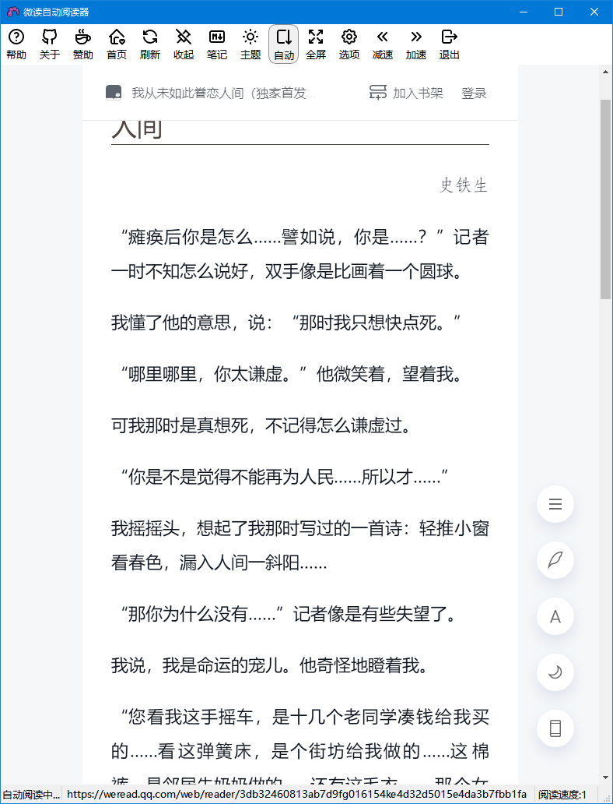
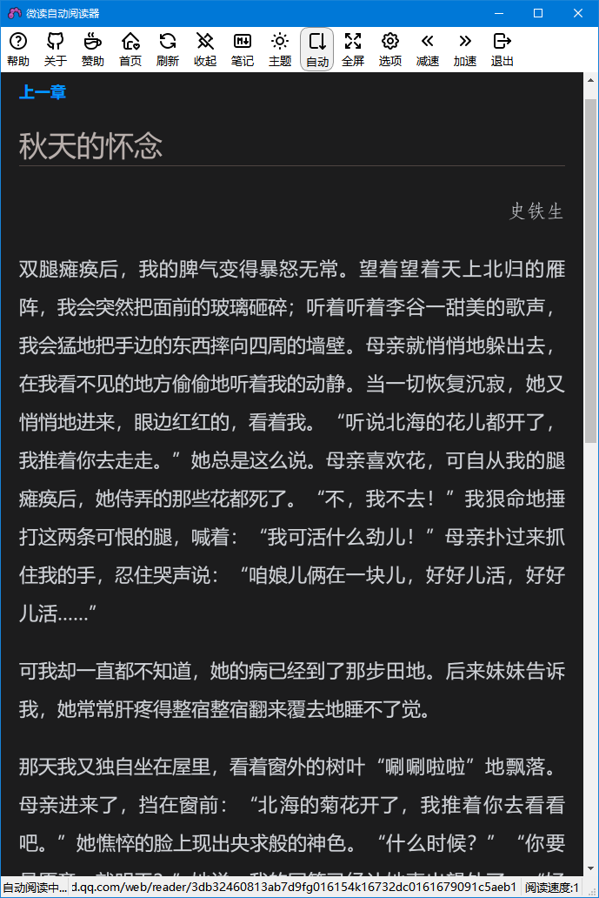

# 微读自动阅读器

使用 **[微读自动阅读器](https://github.com/DoooReyn/WxReader)**，帮助你解放生产力 _（双手）_ ，该干啥干啥去，书币照样拿！

## 演示

---

## 快捷键

| 按键 | 说明             |
| ---- | ---------------- |
| F1   | 打开帮助         |
| F2   | 打开关于         |
| F3   | 打开赞助         |
| F4   | 回到首页         |
| F5   | 刷新页面         |
| F6   | 显示/隐藏工具栏  |
| F8   | 导出笔记         |
| F9   | 切换主题         |
| F10  | 切换自动阅读     |
| F11  | 切换全屏         |
| F12  | 打开更多选项     |
| +    | 加快滚动速度     |
| -    | 降低滚动速度     |
| Home | 回到顶部         |
| End  | 滚到顶部         |
| PgUp | 向上滚动一个视图 |
| PgDn | 向下滚动一个视图 |
| ←    | 上一章(页)       |
| →    | 下一章(页)       |
| ↑    | 向上滚动一行     |
| ↓    | 向下滚动一行     |

## 环境要求

-   **Python < 3.8**

> 因为 cefpython3 对全平台的支持目前最新的版本是 66.0，但是它对 Python 版本的要求是低于 3.8，也就是说 Python 3.8+ 是不能用的，望开发者知悉

## 更新说明

### WxReader 2.0.0 [2022/10/22]

-   全新的 WebView 方案
    -   Qt WebEngine 存在严重的性能问题，本轮优化已完全弃用
    -   cefpython3 在此方面表现非常优异，大幅提升了阅读体验
-   工具栏调整
    -   删除"静默"
    -   "固定"修改为"收起"，并绑定快捷键 F6
    -   顺序调整
    -   悬停时提示加上了快捷键
-   快捷键调整
    -   删除工具栏"静默"动作对应的 Esc
    -   首页从 F3 调整为 F4
    -   F3 分配给"赞助"
-   系统托盘图标行为反馈
    -   单击或双击将激活主窗口
    -   右击不会激活主窗口
-   状态栏调整
    -   "页面加载进度条" 修改为 "显示当前页面地址"

### WxReader 2.0.0-beta.2 [2022/10/18]

-   升级引擎到 PySide6，主要解决 Qt WebEngine 内存占用问题
-   新增安装包
-   更新便携版
    -   对包体进行了精简优化
-   更新 LICENSE

### WxReader 2.0.0-beta [2022/10/11]

-   微读自动阅读器 2.0.0 推出啦！ 首个包是未删减、无压缩的便携版。
-   因为 Qt 的 WebEngine 动态库体积比较大，所以包整体体积也不小。
-   后续会尝试通过不同手段来优化一下包体，敬请期待。

---

## 问题反馈

-   如有问题或建议，请到[官方仓库][1]进行讨论;
-   也可以给我发邮件 **jl88744653@gmail.com**，但请确保主题是**我为微读提意见**，不然可能会被我过滤掉。

[1]: https://github.com/DoooReyn/WxReader
[2]: https://github.com/DoooReyn/WxRead-PC-AutoReader

---

## 做微读自动阅读器的原因

闲的蛋疼！

当然不是！

实际上是因为在微信读书周阅读排行榜里看到了一个 132 小时的 bug 一般的存在，然后向网络求证了一下，发现知乎下有个人问了这个问题，求证之后顺手答了，大家可以在这里看我的回答：[微信读书时长究竟如何计算?](https://www.zhihu.com/question/349487832/answer/1020412380)。

主要还是现行的**挂机方法**太次，所以动手写了这个程序。

为什么我说现行的方法太次？我给你介绍一下它的实现思路：**下载一个安卓模拟器，在模拟器里安装微信读书，通过 ADB 建立模拟器与 Python 脚本之间沟通的桥梁，打开微信读书并选择一本书，运行 Python 脚本，最后由脚本实现微读 UI 自动化，达到模拟机器人读书的目的，也就是挂机了。**

这乍看起来没什么问题吧？然而不是。实际上，首先它涉及到一大堆的概念：

-   安卓模拟器
-   ADB
-   Python 语言
-   Python 依赖

这些步骤对于普通用户来说，实在是过于繁琐和复杂，甚至一不下心就会陷入**我明明按照使用说明做的，为什么就是不行？**的蜜汁困境，我相信只有程序员与极少数的发烧友才可能去折腾这些东西。

而且其中还有很多限制，比如说：ADB 是需要连接调试的，Python 需要安装依赖，模拟器需要设置很长的息屏时间，读完一本书就会暂停而用户根本不知道什么时候会暂停，以及不同 PC 平台部署是有些微差别的，等等。这其中很多事情根本就是开发人员做的事情，你不能把开发的东西丢给终端用户吧！

所以上述问题都可以归结于一点：**由于部署困难导致它的受众范围必然很小**。这是它最失败的地方，也是个人觉得它不会进入大众视野的根本原因，同样也是必然的结果。

---

## 微读自动阅读器是怎么做的

有鉴于此，我换了另外一个思路来实现，其实有点讨巧，而微信读书又刚好很赏脸地上线了微信读书网页版，并且同样计算有效时长！那么，上面所述的部署困难问题从这里开始就已经被完美地解决或者说规避了，因为从现在开始我们仅仅只需要一个 PC 浏览器了！

接下来的问题也是唯一的问题就是如何模拟用户读书从而达到挂机的目的。首先自然是要分析微信读书网页版的阅读习惯是怎么设计的，这样才好安排程序怎么做，这里就不赘述分析过程，直接贴结果了：**网页版同 APP 版一样，书本分章节，不同的是，APP 版翻页会自动跳转到下一章，网页版每章之间有一个`下一章`的按钮，用户必须点击`下一章`才会跳转；书本阅读完毕后不会出现`下一章`。**

明白了微读网页版的机制，接下来就轮到 JavaScript 出场了，现在我们要用 JavaScript 实现：

1. 获取阅读内容高度和屏幕高度；
2. 每隔几秒钟自动滚动页面；
3. 滚动时判断是否滚到底部；
4. 滚到底部时说明本章已阅读完成，可以跳转下一章了；
5. 找到下一章按钮，模拟用户点击，等待进入下一章，然后回到第 1 步继续阅读；如果找不到按钮，则判定本书阅读完毕，发送通知给用户，用户接收到通知，重新选择一本书。

原理很简单，代码也不复杂，唯一碰到的一个问题就是：刚开始使用 setInterval 做定时器，放到后台后时间长了发现频率不对劲，有的时候快有的时候慢，搜索了一下原因是浏览器的耗电保护机制，解决办法是使用 Web Worker，于是重新使用 Web Worker 实现了一次，测试正常了。详细的实现过程就不说了，大家按照**使用说明**直接拿去用就可以了，现在我们只要 3 个步骤就可以轻轻松松地一边上班一边挂(摸)机(鱼)了：

1. 打开微读网页版、打开任意一本书；
2. 点击 `微信读书自动阅读器` 开启自动阅读；
3. 等待阅读完成通知，回到第一步。

**PS:** 其实，我还连夜学了怎么写 Chrome 扩展，然后只要打开微读网页版，点开任意一本书就会自动开启阅读程序，本来想发到 Chrome 商店的，但是 Chrome 发布扩展竟然要\$，而我实在懒(非)得(常)折(的)腾(穷)了。如果您愿意拿一点点小小的心意资助，请扫下方二维码，鄙人不胜感激。

---

### 想说的话

**微读阅读器**从**2020.02.17**开始立项，出发点原本就是一个意外，但东西出来之后，意外地收到了很多朋友的喜欢和关注。

从最初的网页版，衍变到后来基于**Electron.js**开发的 PC 版问世，自此之后**微读阅读器**的版本就一直停留在**1.3.0**。
因为它纯粹是我一时热血上头开发的一个小工具，所以不会让它太占用我的个人时间。
尽管后来收到了一些反馈和建议，但是 U Know，懒是阶段性的，热情下头之后就很难抬起手来继续了。

如今，时隔两年半，收到了不少用户反馈之后，**微读阅读器 2.0** 终于发布啦！

相比 **1.3**，**2.0** 做了比较大的改进，主要包括：

-   弃用 **Electron.js** 框架，改用 **PySide6** 作为底层支持;
-   所有操作都放在了工具栏，操作更加简单直接，大大提升用户体验；
-   修复大范围挂机暂停的问题：
    -   **1.3** 在切换页面之后就会进行滚动判定，如果内容未加载完毕，可能造成误判；
    -   **2.0** 只有当页面内容完全载入之后才会开启滚动；
    -   **1.3** 的页面滚动失效问题比较严重
    -   **2.0** 使用应用级定时器来刷新滚动状态，目前测试来看还算比较稳定；
-   优化自动阅读时暂停的条件：选中文本、打开目录、打开评论；
-   增加速度、步幅设置，放宽速度限制；
-   增加全文阅读完成时发送 **GET** 请求的功能；
-   **2.0**将完全开源，但未经允许禁止投入商业使用。

最后，**微读阅读器 2.0**是基于 **PySide6** 全新开发的，整个过程差不多花了一周 _（因为国庆罢工啦）_，时间上是比较仓促的，
因此很可能还存在一些问题或体验上的不足，后续会陆续跟进维护，也欢迎大家到[官方仓库][1]
提问题。

> **2022/10/22 更新**
>
> 新一轮优化弃用 QtWebEngine，全面拥抱性能极佳的 **cefpython3**，这次释放出的是正式版，欢迎大家体验！

---

## 写在最后

开发不易，请大家多多支持！😊

 

---

## 声明

本仓库仅提供代码，一切责任由使用者自行承担。
