# 传奇系列

> 传奇类游戏是 MMORPG 中的一种，主要玩法就是打怪、升级、爆装备，帮助玩家在游戏中获得华丽绚烂、爆砍爆杀的快感。受众人群是最早接触网络游戏的那一批，其中的 RMB 玩家是这类游戏的主要收入来源。
>
> 传奇类游戏涉及的技术难点也是蛮多的，简单列举几个:
>
> -   大地图 **加载**、**拼接** 和 **寻路**
> -   状态同步
> -   不能太随便的打击感，简单来说就是攻击、技能释放之后得到的反馈体验
> -   最重要的是，由于存在大量的角色、怪物、坐骑、血条、掉血、特效等节点同屏，因此需要一套健壮的内存、DC 优化机制
>
> 本人从 18 年开始，做了两年的传奇游戏前端开发，其中主要有三款：**战神传奇**，**屠龙英雄** 以及 **武炼巅峰**，虽然后面还有**烈焰主宰**啥的，但基本是立足前几款做一些微调，直白地说几乎等于换皮了。
>
> 有意思的是**武炼巅峰**，是公司花了大价钱买的仙侠类 IP，也就是仙侠的外皮套了个传奇的核心，结果没打开市场，宣告失败了。从结果上看，玩家更愿意接受暗黑系列的风格，比如地下城、沙城等，所以相对来说，**战神传奇** 和 **屠龙英雄**的流水就好很多了。

## 一、战神传奇

> 官方链接：[点击前往](https://zssy.zqgame.com/)
> 百度百科: [点击前往](https://baike.baidu.com/item/%E6%88%98%E7%A5%9E%E4%BC%A0%E5%A5%87/24678699)

-   主城地图

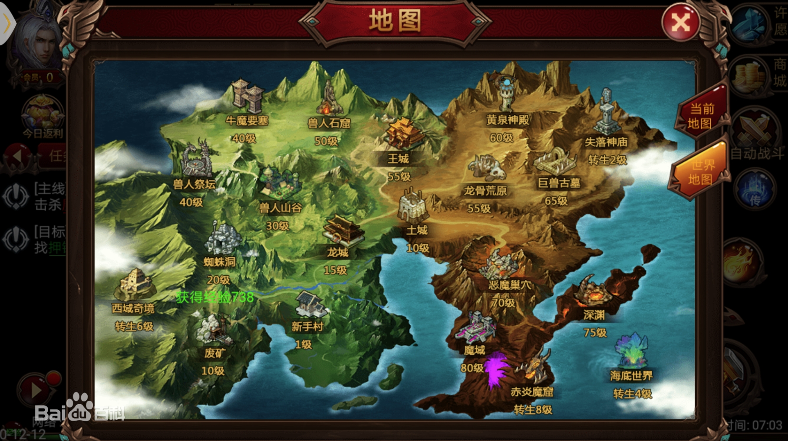

-   角色

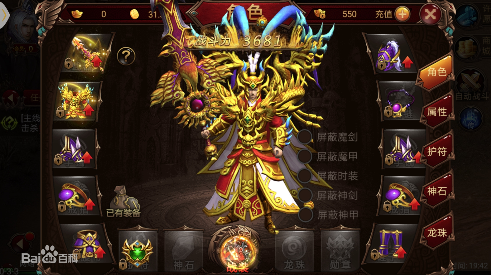

-   商城

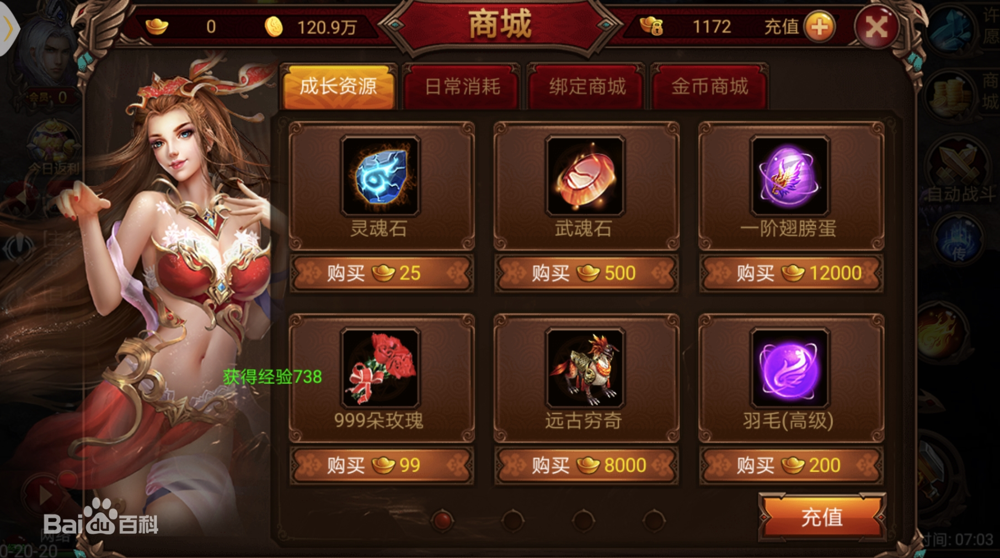

-   竞技场

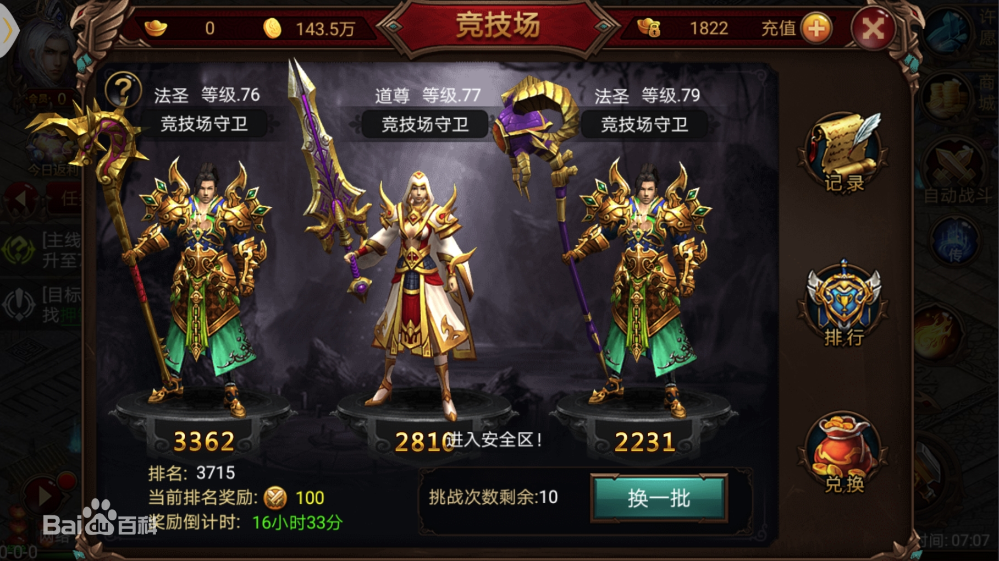

-   王城争霸

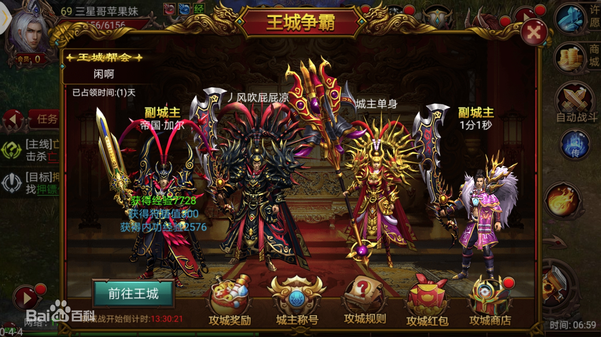

---

## 二、屠龙英雄

> 官网链接：[点击前往](http://tl.tmgigame.com/)

-   三大职业·战神

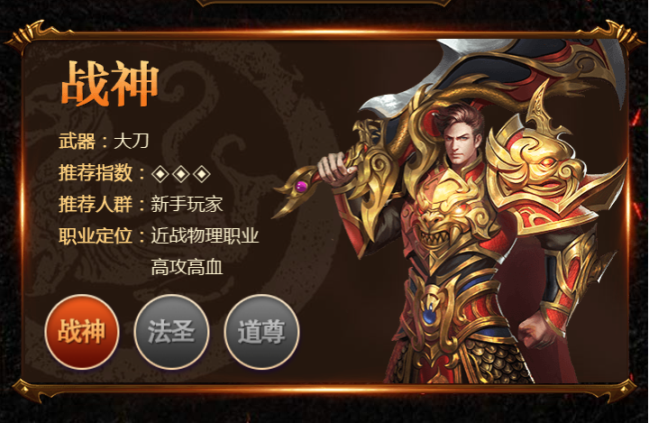

-   三大职业·法圣

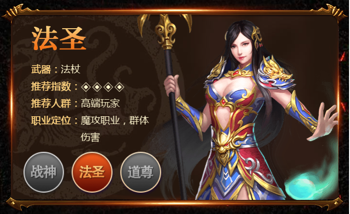

-   三大职业·道尊

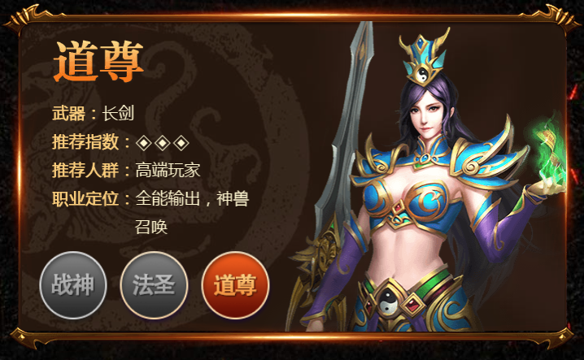

-   热血攻城

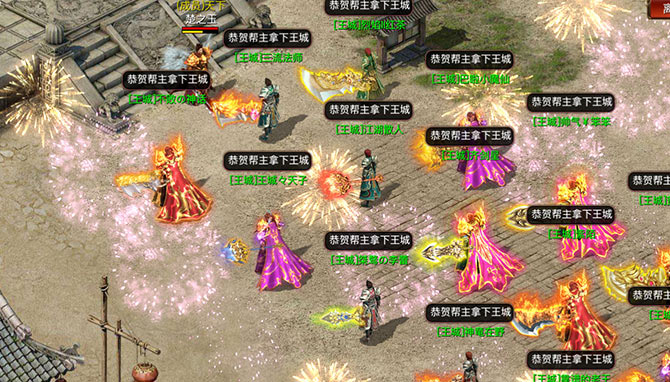

-   爆品装备

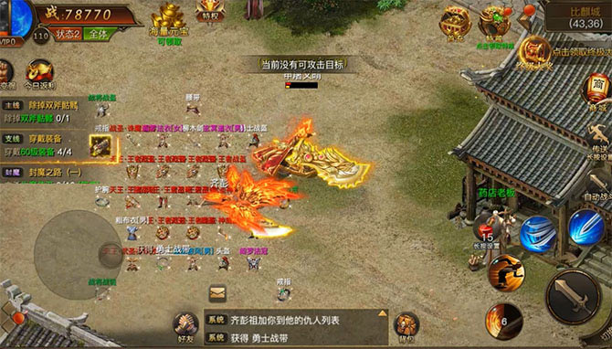

-   自由交易

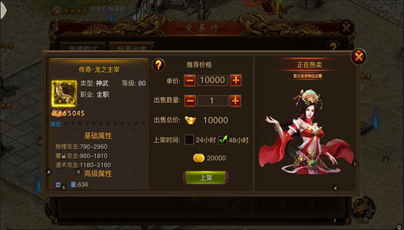

-   自动战斗

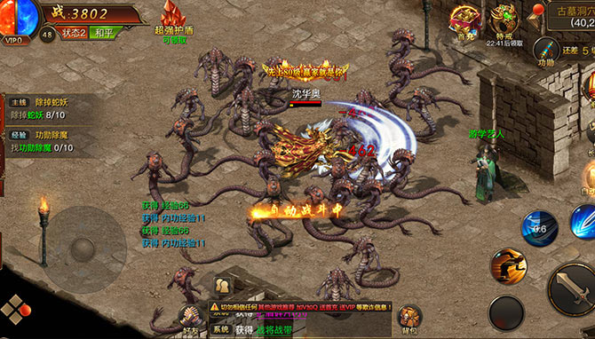
