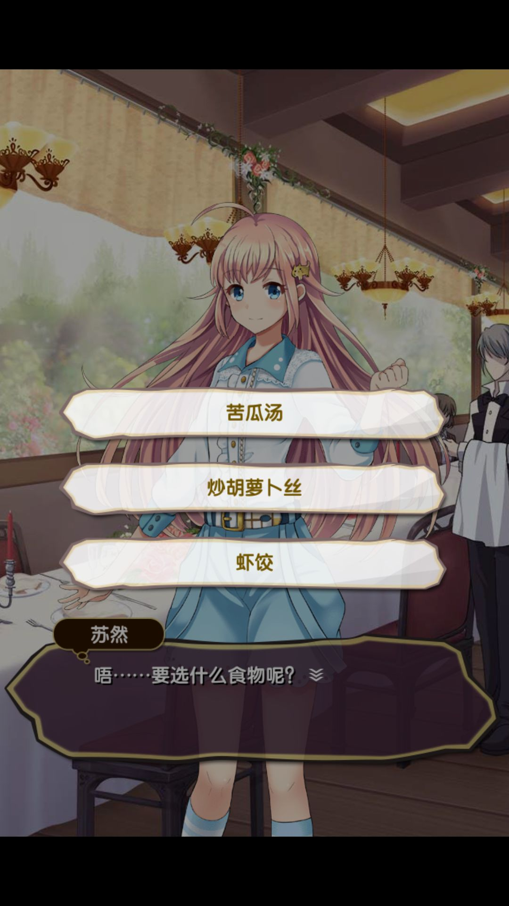

# 元气偶像季

## 一、简单介绍

## 二、官方链接

-   [心动网络](http://op.xd.com/yq/) 
-   [TapTap](https://www.taptap.com/app/16178) 
-   [百度百科](https://baike.baidu.com/item/%E5%85%83%E6%B0%94%E5%81%B6%E5%83%8F%E5%AD%A3/20429455)

## 三、技术选型

-   前端：Cocos2d-x / Lua
-   后端：PHP

## 四、技术难点

-   转场表现
    -   主要用在演唱会、助威等场景，这个实现不难，主要就是动画，难得是要调整到流畅，当时没有 Creator 中这么方便的动画系统，完全靠手写代码，调一个场景的工作量还是挺大的
-   剧情框架
    -   剧情表现依赖的是我们完全自研的一套剧情框架，根据玩家的选择不同，剧情走向也会截然不同；同时配合表现和剧情事件系统，呈现给玩家的体验十分丰富。

## 五、截图展示

