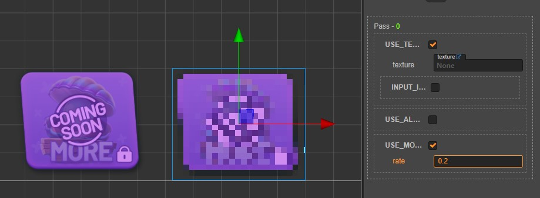

# 马赛克 Effect

**代码**

```yaml
// Copyright (c) 2017-2018 Xiamen Yaji Software Co., Ltd.

CCEffect %{
  techniques:
  - passes:
    - vert: vs
      frag: fs
      blendState:
        targets:
        - blend: true
      rasterizerState:
        cullMode: none
      properties:
        texture: { value: white }
        alphaThreshold: { value: 0.5 }
        rate: {
          value: 0.1,
          editor: {
            tooltip: "马赛克模糊度（值越大越模糊）",
            range: [0.0, 1.0]
          }
        }
}%


CCProgram vs %{
  precision highp float;

  #include <cc-global>
  #include <cc-local>

  in vec3 a_position;
  in vec4 a_color;
  out vec4 v_color;

  #if USE_TEXTURE
  in vec2 a_uv0;
  out vec2 v_uv0;
  #endif

  void main () {
    vec4 pos = vec4(a_position, 1);

    #if CC_USE_MODEL
    pos = cc_matViewProj * cc_matWorld * pos;
    #else
    pos = cc_matViewProj * pos;
    #endif

    #if USE_TEXTURE
    v_uv0 = a_uv0;
    #endif

    v_color = a_color;

    gl_Position = pos;
  }
}%


CCProgram fs %{
  precision highp float;

  #include <alpha-test>
  #include <texture>

  in vec4 v_color;

  #if USE_TEXTURE
  in vec2 v_uv0;
  uniform sampler2D texture;
  #endif

  #if USE_MOSAIC
  uniform Mosaic {
    float rate;
  };

  vec2 getMosaicUvPos() {
    float size;
    if (rate <= 0.0) {
      return v_uv0;
    } else {
      size = rate * 0.1;
    }

    float blockXIndex = floor(v_uv0.x / size);
    float blockYIndex = floor(v_uv0.y / size);
    return vec2(size * (blockXIndex + 0.8), size * (blockYIndex + 0.8));
  }
  #endif

  void main () {
    vec4 o = vec4(1, 1, 1, 1);

    vec2 realPos = v_uv0;
    #if USE_MOSAIC
    realPos = getMosaicUvPos();
    #endif

    #if USE_TEXTURE
      CCTexture(texture, realPos, o);
      #if CC_USE_ALPHA_ATLAS_TEXTURE
      o.a = 1.0;
      #endif
    #endif

    o *= v_color;

    ALPHA_TEST(o);

    gl_FragColor = o;
  }
}%


```

**展示**

