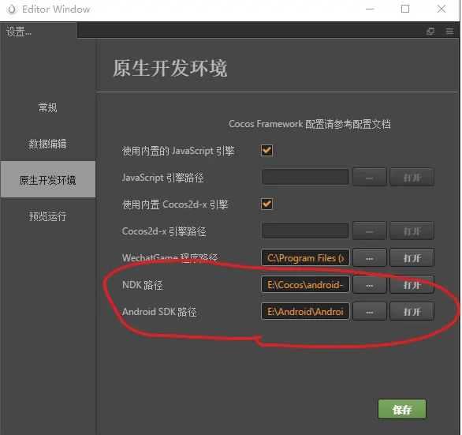
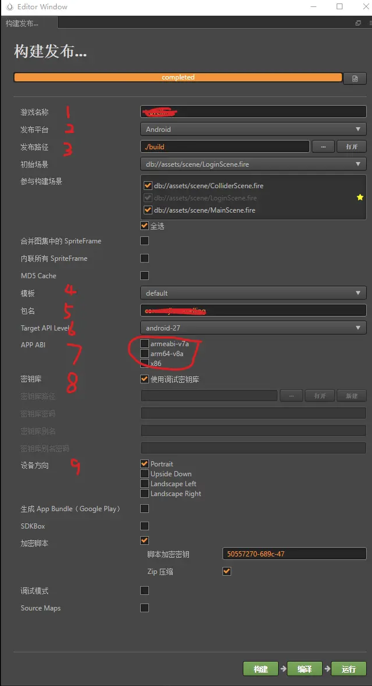

# 记一次 Cocos Creator Android 打包总结

**一. 准备材料**

-   Cocos Creator（版本 2.0.9）
-   JDK（注意是 JDK 而不是 JRE，`JAVA_HOME` 要在环境变量中声明并添加）
-   Python （版本要求 >2.7.5，且 <3.0）
-   Android SDK (注意下载对应的平台 platform)
-   Android NDK (ANDROID_NDK_ROOT 要在环境变量中声明并添加，NDK 的版本使用 r10e 时编译失败了，在官方论坛里找到帮助帖子，后来用了 r16b 编译成功)
-   ndk-wsls-3.0（用于解决 win10 路径长度不能超过 250 的问题，这个问题会导致莫名其妙的 bug，下载地址：[https://forum.cocos.com/uploads/default/original/3X/d/6/d61b0caa8177c098cfa0bb5f96a00802eb9cb559.zip](https://forum.cocos.com/uploads/default/original/3X/d/6/d61b0caa8177c098cfa0bb5f96a00802eb9cb559.zip)）

**二、打包设置**

1.  打开 Cocos Creator，打开要打包的项目
2.  打开文件，选择设置，在原生开发环境一栏填入 NDK 路径和 Android SDK 路径，确认之后保存设置，关闭即可

3.  打开项目，选择构建发布，填入参数

1）填入游戏名称
2）选择发布平台为 `Android`
3）选择发布路径，默认为 `./build`
4）选择工程模板，`default` 即可
5）填入包名
6）选择 `Target API Level`，我这里是 `android-27`，具体情况根据你的 Android SDK 而定
7）选择 `APP ABI`，我这里都不选
8）是否使用调式密钥库（由于我只是尝试打包，因此选择是，如果需要发布正式版，请自行生成密钥）
9）选择设备方向，按照项目的规格选择即可

4. 选择构建，等待构建完成
5. 构建完成，接着选择编译，等待编译完成
6. 编译完成，控制台会输出 APK 包所在路径日志，一般在发布路径下的 `jsb-default\publish\android`

**三、其他**

构建和编译过程中可能会碰到很多报错，这个时候要注意查看控制台的日志报错信息，然后提取关键字段到官方论坛找找看，大部分原因都可以找到解决方案。

在这个尝试打包过程中，我查了官方的教程和好几个网上的教程，没有一个是完美运行的。所以说，实际情况比教程复杂的多（包括这篇教程也是，只能给你提供一些免绕弯路的建议，并不能完美规避所有的问题），造成打包失败的原因多种多样，可能是 XX 工具的版本问题，也可能是环境配置不正确，还可能仅仅是路径太长系统识别不了，我也是试了很多错，才总结出来这些。

最后还是希望官方把教程完善起来，已经造出了虎头，不要败在了蛇尾。祝好！
