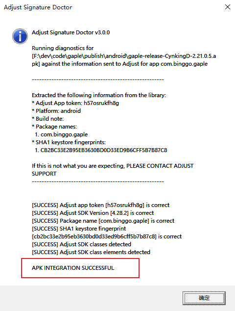

# Adjust 签名第二版 Android 集成指南

## 0.集成步骤说明

1. 客户端提取 App 包密钥的 SHA1，提交给运营
2. 运营将 SHA1 提交给 Adjust，Adjust 处理后生成一个 aar 签名包
3. 运营将 arr 包和 AppToken 交给客户端，客户端集成 arr 签名包
4. 出包后验证签名包是否已经集成

## 1.SHA1 的提取

```bash
keytool −list −v −keystore <location/of/your/key.keystore> −alias YOUR_KEY_ALIAS
```

## 2.集成签名 arr 包

-   app 级 build.grale 下添加 adjust 的包

```gradle
 implementation 'com.adjust.sdk:adjust-android:4.28.3'
 implementation 'com.android.installreferrer:installreferrer:2.2'
```

-   将签名 arr 包放到指定渠道包的 libs 目录下
-   打包即可

## 3.验证集成结果

> 运行 Adjust 提供的验证工具：`adjust_sig_doctor`，输入 AppToken，之后选择打出来的包，确认即可；稍等一会之后，会弹出提示框，告诉你是否集成成功。


