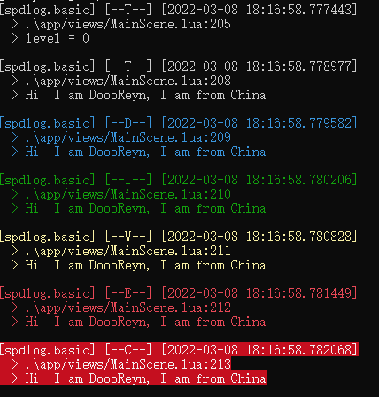
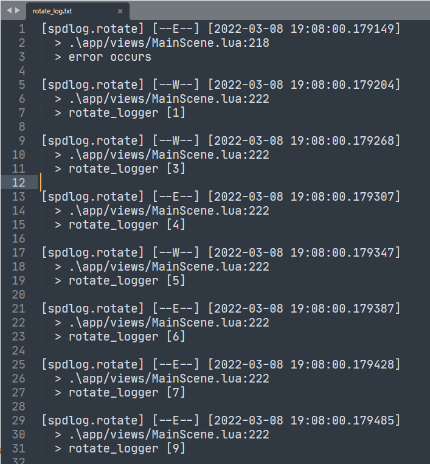

# Cocos2d-x 使用 spdlog 日志库

## 一、介绍

[**spdlog**](https://github.com/gabime/spdlog) 是一个开源的、超快的、仅有头文件的 C++11 日志库。它具备如下特性：

-   速度超快
-   仅有头文件，移植超简单
-   超好用的格式化库，支持自定义标签
-   支持控制台颜色输出
-   支持日志轮替
-   支持异步
-   日志过滤
-   等等

基础示例：

```cpp
#include "spdlog/spdlog.h"

int main()
{
    spdlog::info("Welcome to spdlog!");
    spdlog::error("Some error message with arg: {}", 1);
    spdlog::warn("Easy padding in numbers like {:08d}", 12);
    spdlog::critical("Support for int: {0:d};  hex: {0:x};  oct: {0:o}; bin: {0:b}", 42);
    // Set global log level to debug
    spdlog::set_level(spdlog::level::debug);
    spdlog::debug("This message should be displayed..");
    // change log pattern
    spdlog::set_pattern("[%H:%M:%S %z] [%n] [%^---%L---%$] [thread %t] %v");
    spdlog::info("Welcome to spdlog!");
    // output: [18:38:38 +08:00] [] [---I---] [thread 16044] Welcome to spdlog!
}
```

## 二、移植到 Cocos2d-x

**spdlog** 支持的功能很多，但我们基本就用到控制台日志、文件日志、轮替日志。

1. 将 [spdlog 头文件目录](https://github.com/gabime/spdlog/tree/v1.x/include/spdlog) 拷贝到 `external/spdlog` 下，并添加到附加包含目录
2. 在 C++ 层稍微封装一下基础接口

    - create
    - trace
    - debug
    - info
    - warn
    - err
    - critical
    - set_level
    - get_level
    - set_pattern
    - set_default_formatter
    - enable_backtrace
    - dump_backtrace
    - disable_backtrace
    - flush

    ```cpp

    // 获取日期
    string date_time(time_t posix)
    {
        char buf[20]; // big enough for 2015-07-08 10:06:51\0
        tm tp = *localtime(&posix);
        return { buf, strftime(buf, sizeof(buf), "%F %T", &tp) };
    }

    // 格式化时间戳
    string stamp() {
        auto now = system_clock::now();

        // use milliseconds % 1000000 now
        auto ms = duration_cast<microseconds>(now.time_since_epoch()) % 1000000;

        ostringstream oss;
        oss.fill('0');
        oss << date_time(system_clock::to_time_t(now));
        oss << '.' << setw(6) << ms.count();

        return oss.str();
    }

    // 自定义日志格式
    class my_formatter_flag : public spdlog::custom_flag_formatter
    {
    public:
        void format(const spdlog::details::log_msg &, const tm &, spdlog::memory_buf_t &dest) override
        {
            string some_txt = stamp();
            dest.append(some_txt.data(), some_txt.data() + some_txt.size());
        }

        unique_ptr<custom_flag_formatter> clone() const override
        {
            return spdlog::details::make_unique<my_formatter_flag>();
        }
    };

    // 文件日志
    class FileLogger : public Ref {
    public:
        FileLogger() {};

        static FileLogger* create(string path) {
            FileLogger * ret = new (nothrow) FileLogger();
            if (ret && ret->init(path))
            {
                ret->autorelease();
            }
            else
            {
                CC_SAFE_DELETE(ret);
            }
            return ret;
        }

        bool init(string path) {
            try
            {
                m_logger = make_shared<spdlog::sinks::basic_file_sink_mt>(path.c_str(), true);
                m_name = "spdlog.file";
                set_default_formatter();
            }
            catch (const spdlog::spdlog_ex &ex)
            {
                CCLOG("File logger init failed: %s", ex.what());
                return false;
            }

            retain();
            return true;
        }

        void set_default_formatter() {
            auto formatter = make_unique<spdlog::pattern_formatter>();
            formatter->add_flag<my_formatter_flag>('*').set_pattern("%^[%n] [--%L--] [%*]%v%$");
            logger().set_formatter(move(formatter));
        }

        int get_level() {
            return logger().level();
        }

        void set_level(int level) {
            if (level < spdlog::level::trace || level >= spdlog::level::n_levels) return;
            logger().set_level(spdlog::level::level_enum(level));
        }

        void enable_backtrace(int num) {
            logger().enable_backtrace(num);
        }

        void disable_backtrace() {
            logger().disable_backtrace();
        }

        void dump_backtrace() {
            logger().dump_backtrace();
        }

        void set_pattern(string pattern) {
            logger().set_pattern(pattern);
        }

        void flush() {
            logger().flush();
        }

        void trace(string msg) {
            logger().trace(msg);
        }

        void debug(string msg) {
            logger().debug(msg);
        }

        void info(string msg) {
            logger().info(msg);
        }

        void warn(string msg) {
            logger().warn(msg);
        }

        void err(string msg) {
            logger().error(msg);
        }

        void critical(string msg) {
            logger().critical(msg);
        }

        spdlog::logger logger() {
            return spdlog::logger(m_name, m_logger);
        }

    protected:
        string m_name;
        spdlog::sink_ptr m_logger;
    };

    class RotateLogger : public FileLogger {
    public:
        static RotateLogger* create(string path, int page_size, int max_files) {
            RotateLogger * ret = new (nothrow) RotateLogger();
            if (ret && ret->init(path, page_size, max_files))
            {
                ret->autorelease();
            }
            else
            {
                CC_SAFE_DELETE(ret);
            }
            return ret;
        }

        bool init(string path, int page_size, int max_files) {
            try
            {
                m_logger = make_shared<spdlog::sinks::rotating_file_sink_mt>(path.c_str(), page_size, max_files);
                m_name = "spdlog.rotate";
                set_default_formatter();
            }
            catch (const spdlog::spdlog_ex &ex)
            {
                CCLOG("Rotate logger init failed: %s", ex.what());
                return false;
            }

            retain();
            return true;
        }
    };
    ```

3. 使用 [kaguya](https://github.com/satoren/kaguya) 导出接口给 Lua

    ```cpp
    LUA_API int lua_module_register_logger(lua_State* L) {
        kaguya::State state(L);

        // spdlog
        state["spdlog"] = kaguya::NewTable();
        kaguya::LuaTable module = state["spdlog"];

        // spdlog<enum> level
        module["level"] = kaguya::NewTable();
        kaguya::LuaTable level_module = module["level"];
        level_module["trace"] = spdlog::level::trace;
        level_module["debug"] = spdlog::level::debug;
        level_module["info"] = spdlog::level::info;
        level_module["warn"] = spdlog::level::warn;
        level_module["err"] = spdlog::level::err;
        level_module["critical"] = spdlog::level::critical;
        level_module["off"] = spdlog::level::off;
        // spdlog<api>
        module["get_level"] = &spdlog::get_level;
        module["set_level"] = kaguya::function([](int level) {
            if (level < spdlog::level::trace || level >= spdlog::level::n_levels) return;
            spdlog::set_level(spdlog::level::level_enum(level));
        });
        module["trace"] = kaguya::function([](string text) {
            spdlog::trace(text);
            });
        module["debug"] = kaguya::function([](string text) {
            spdlog::debug(text);
        });
        module["info"] = kaguya::function([](string text) {
            spdlog::info(text);
        });
        module["warn"] = kaguya::function([](string text) {
            spdlog::warn(text);
        });
        module["err"] = kaguya::function([](string text) {
            spdlog::error(text);
        });
        module["critical"] = kaguya::function([](string text) {
            spdlog::critical(text);
        });
        module["set_pattern"] = kaguya::function([](string text) {
            spdlog::set_pattern(text);
        });
        module["flush_every"] = kaguya::function([](int sec) {
            spdlog::flush_every(chrono::seconds(sec));
        });
        module["enable_backtrace"] = kaguya::function([](int num) {
            spdlog::enable_backtrace(num);
        });
        module["dump_backtrace"] = kaguya::function([]() {
            spdlog::dump_backtrace();
        });
        module["disable_backtrace"] = kaguya::function([]() {
            spdlog::disable_backtrace();
        });

        auto formatter = make_unique<spdlog::pattern_formatter>();
        formatter->add_flag<my_formatter_flag>('*').set_pattern("%^[spdlog.basic] [--%L--] [%*]%v%$");
        spdlog::set_formatter(move(formatter));

        // file_logger
        module["file_logger"].setClass(
            kaguya::UserdataMetatable<FileLogger>()
            //.setConstructors<FileLogger()>()
            .addFunction("set_default_formatter", &FileLogger::set_default_formatter)
            .addFunction("get_level", &FileLogger::get_level)
            .addFunction("set_level", &FileLogger::set_level)
            .addFunction("set_pattern", &FileLogger::set_pattern)
            .addFunction("flush", &FileLogger::flush)
            .addFunction("enable_backtrace", &FileLogger::enable_backtrace)
            .addFunction("dump_backtrace", &FileLogger::dump_backtrace)
            .addFunction("disable_backtrace", &FileLogger::disable_backtrace)
            .addFunction("trace", &FileLogger::trace)
            .addFunction("debug", &FileLogger::debug)
            .addFunction("info", &FileLogger::info)
            .addFunction("warn", &FileLogger::warn)
            .addFunction("err", &FileLogger::err)
            .addFunction("critical", &FileLogger::critical)
            .addStaticFunction("create", &FileLogger::create)
        );

        return module.push();
    }
    ```

4. 为了保证 `basic/file/rotate logger` 使用上的一致性，需要在 Lua 层封装一下

    ```lua
    -- logger.lua
    local LoggerFactory = {
        __logger = {}
    }

    function LoggerFactory:has(logger)
        return not not self.__logger[tostring(logger)]
    end

    function LoggerFactory:_wrap(logger)
        if self:has(logger) then return end

        self.__logger[tostring(logger)] = true
        local _self = logger
        local _trace = _self.trace
        local _debug = _self.debug
        local _info = _self.info
        local _warn = _self.warn
        local _err = _self.err
        local _critical = _self.critical
        local is_userdata = type(logger) == 'userdata'
        if is_userdata then
            local _log = logger
            local _mt = {__index = function(self, k)
                local v = rawget(self, k)
                if v ~= nil then return v end
                return _log[k]
            end}
            local _logger = {}
            setmetatable(_logger, _mt)
            logger = _logger
        end


        local function getDebugInfo(msg)
        end

        local function forward(method)
            return function(_, msg)
                local top = debug.getinfo(2, "nSlf")
                msg = ("\n  > {1}:{2}\n  > {3}\n"):interpolate({top.source, top.currentline, msg})
                if is_userdata then
                    method(_self, msg)
                else
                    method(msg)
                end
            end
        end

        local function forwardAny(method)
            return function(_, ...)
                if not method then return end
                if is_userdata then
                    return method(_self, ...)
                else
                    return method(...)
                end
            end
        end

        logger.trace = forward(logger.trace)
        logger.debug = forward(logger.debug)
        logger.info = forward(logger.info)
        logger.warn = forward(logger.warn)
        logger.err = forward(logger.err)
        logger.critical = forward(logger.critical)
        logger.set_level = forwardAny(logger.set_level)
        logger.get_level = forwardAny(logger.get_level)
        logger.enable_backtrace = forwardAny(logger.enable_backtrace)
        logger.dump_backtrace = forwardAny(logger.dump_backtrace)
        logger.disable_backtrace = forwardAny(logger.disable_backtrace)
        logger.set_default_formatter = forwardAny(logger.set_default_formatter)
        logger.create = forwardAny(logger.create)
        logger.flush = forwardAny(logger.flush)
        logger.set_pattern = forwardAny(logger.set_pattern)

        return logger
    end

    function LoggerFactory:createDefaultLogger()
        return self:_wrap(spdlog)
    end

    function LoggerFactory:createFileLogger(filename)
        local log_dir = cc.FileUtils:getInstance():getWritablePath()
        local log_path = log_dir .. filename
        local logger = spdlog.file_logger.create(log_path)
        return self:_wrap(logger)
    end

    function LoggerFactory:createRotateLogger(filename, page_size, max_files)
        page_size = page_size or 1024 * 1024
        max_files = max_files or 3
        local log_dir = cc.FileUtils:getInstance():getWritablePath()
        local log_path = log_dir .. filename
        local logger = spdlog.rotate_logger.create(log_path, page_size, max_files)
        return self:_wrap(logger)
    end


    local Logger = class("Logger")

    function Logger.getInstance()
        if not Logger._instance then
            Logger._instance = Logger.new()
            Logger._instance.basic = LoggerFactory:createDefaultLogger()
            Logger._instance.file = LoggerFactory:createFileLogger('log.txt')
            Logger._instance.rotate = LoggerFactory:createRotateLogger('rotate_log.txt')
        end
        return Logger._instance
    end

    return Logger
    ```

5. 测试测试

    ```lua
    local Logger = require("logger").getInstance()

    -- basic
    Logger.basic:set_level(spdlog.level.trace)
    Logger.basic:set_level(spdlog.level.trace)
    Logger.basic:trace(string.interpolate('level = {1}', {Logger.basic:get_level()}))
    local fmt = 'Hi! {who} am {name}, {who} am from {from}'
    local msg = fmt:interpolate({who = 'I', name = 'DoooReyn', from = 'China'})
    Logger.basic:trace(msg)
    Logger.basic:debug(msg)
    Logger.basic:info(msg)
    Logger.basic:warn(msg)
    Logger.basic:err(msg)
    Logger.basic:critical(msg)

    -- file
    Logger.file:info("file_logger")

    -- rotate
    Logger.rotate:enable_backtrace(32)
    Logger.rotate:err("error occurs")
    local methods = {"trace", "debug", "info", "warn", "err", "critical"}
    for i=1,32 do
        local method = methods[math.random(1, 6)]
        Logger.rotate[method](method, ("rotate_logger [{1}]"):interpolate({i}))
    end
    Logger.rotate:dump_backtrace()
    Logger.rotate:disable_backtrace()
    ```

-   控制台输出

    

-   轮替日志

    

如果你喜欢这篇文章，不要忘了 [Star](https://github.com/DoooReyn/cocos2d-x-spdlog) 哦~
