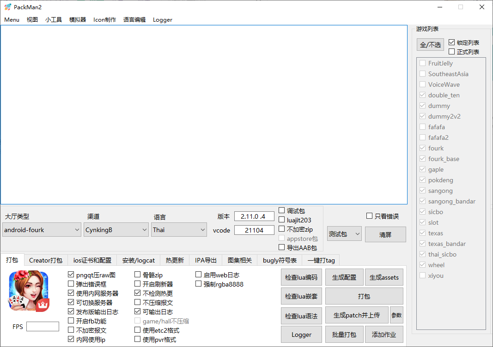
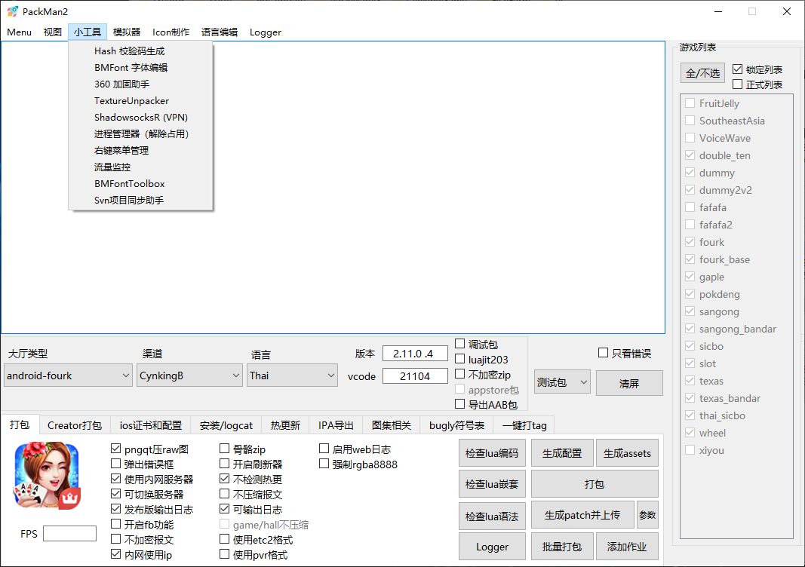
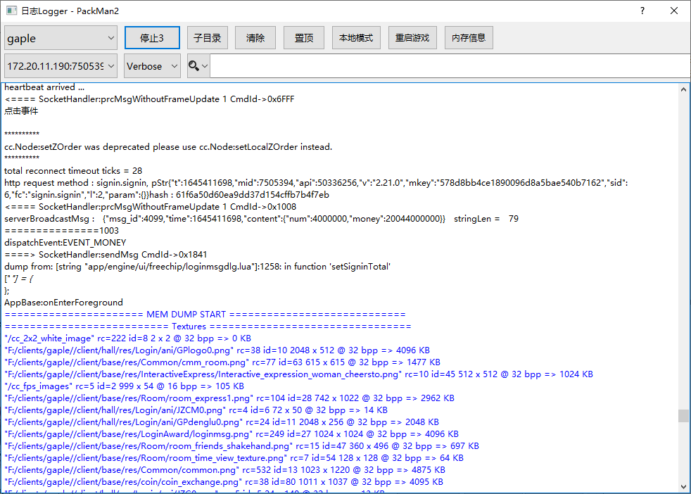
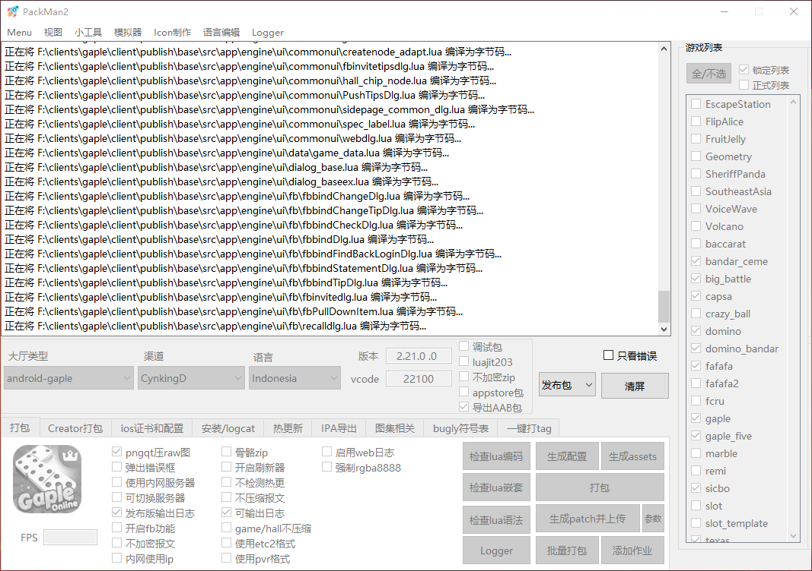
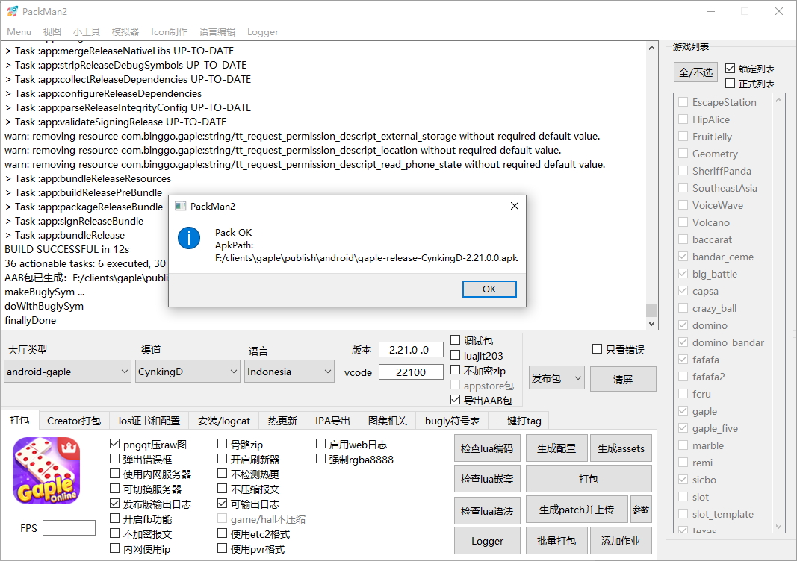
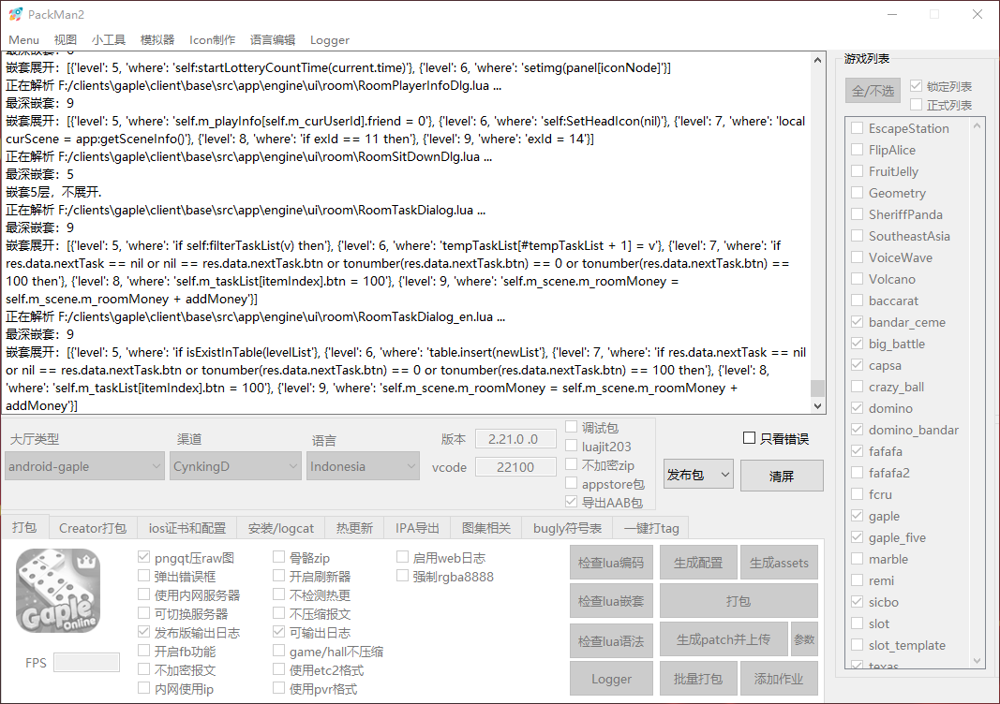

# 公司用打包工具 PackManV2

## 技术选型

-   Python 3.6
-   PyQt5
-   Bat/Cmd/PowerShell/Shell 脚本

## 特性

-   Android/iOS 项目打包，支持导出 Android aab 包
-   项目配置自由编辑
-   本地模拟器多开
-   热更新包生成与上传
-   BMFont 制作工具
-   图集打包和提取
-   多语言编辑
-   多尺寸 icon 一键生成
-   Lua 项目日志跟踪
-   Lua 语法、嵌套层级、文件编码检测
-   等等......

## 截图展示

-   主界面
    

-   小工具
    

-   日志跟踪器
    

-   打包过程
    

-   打包结果
    

-   Lua 嵌套检测
    
