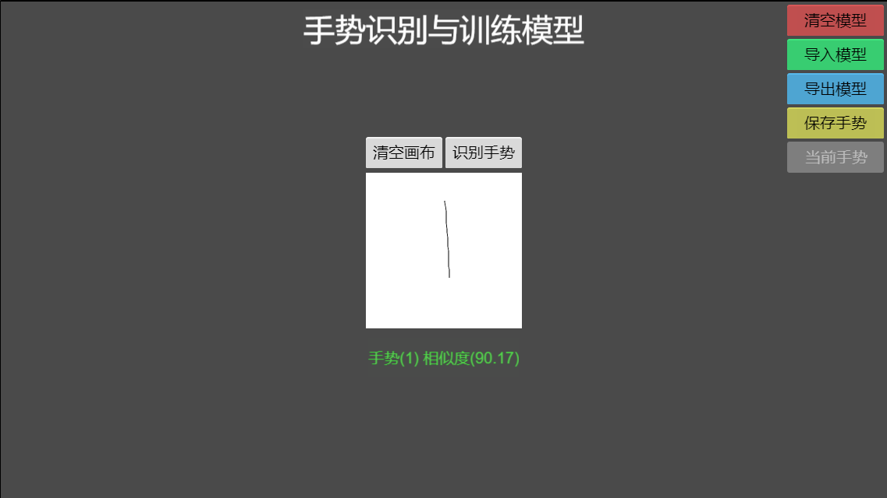
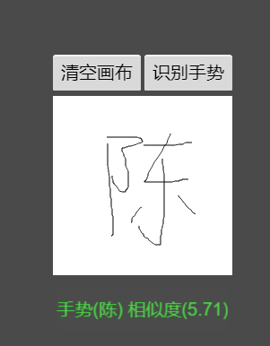

# 手势识别与训练模型

## 依赖

-   Cocos Creator 2.4.5+
-   [手势识别库 gesrec](https://github.com/uwdata/gestrec)

## 示例

```javascript
var gestrec = require("gestrec");
var store = new gestrec.GestureStore();

// a stroke is a collection of timestamped points
var stroke = new gestrec.Stroke([
    //  gestrec.Point( x, y, t)
    new gestrec.Point(2, 5, 1),
    new gestrec.Point(2, 9, 2),
]);
// a gesture is a collection of one or more strokes
var gesture = new gestrec.Gesture([stroke]);

// build a recognizer by providing gesture training examples
// repeat to provide multiple examples for each named gesture class
store.addGesture("line_down", gesture);

// gestures can be read from JSON-style objects
var down = gestrec.Gesture.fromJSON([
        [
            { x: 4, y: 1, t: 1 },
            { x: 4, y: 3, t: 2 },
        ],
    ]),
    left = gestrec.Gesture.fromJSON([
        [
            { x: 4, y: 1, t: 1 },
            { x: 8, y: 1, t: 2 },
        ],
    ]);

// recognize a matching (high-scoring) gesture
var prediction = store.recognize(down);
console.log(JSON.stringify(prediction));
// [{"name":"line_down","score":67108864}]

// recognize a non-matching (low-scoring) gesture
prediction = store.recognize(left);
console.log(JSON.stringify(prediction));
// [{"name":"line_down","score":0.6366197723675814}]
```

## 原理

-   下载[手势识别库](https://github.com/uwdata/gestrec/blob/master/gestrec.min.js)，在 creator 中作为插件导入;
-   用 `cc.Graphics` 来模拟手写，并记录其笔迹数据；
-   将笔迹数据转换为 `gestrec.Point` 数组，使用 `gestrec.Gesture.fromJSON` 将其构建为手势；
-   使用 `gestrec.GestureStore.recognize` 来识别手势；
-   这样一来，我们就可以存储手势，并将其作为训练模型，原则上只要训练模型足够大，识别能力就会更强。

## 展示

-   [查看在线演示](https://wu57.cn/games/gesture/web-desktop)

    -   支持模型训练

    -   支持模型导入

    -   支持模型导出

-   截图展示

    

    
